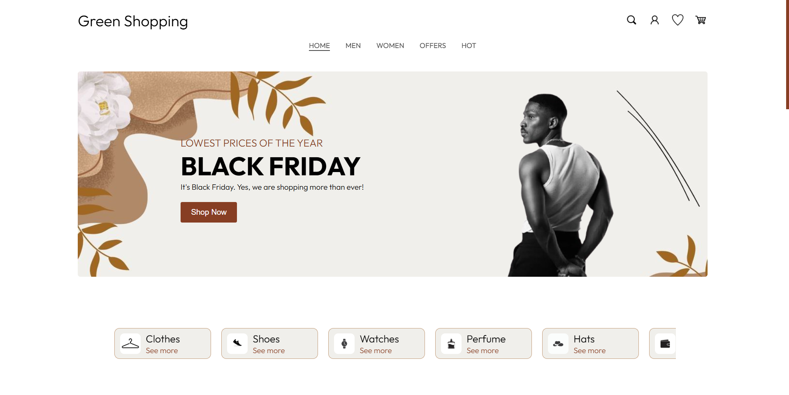
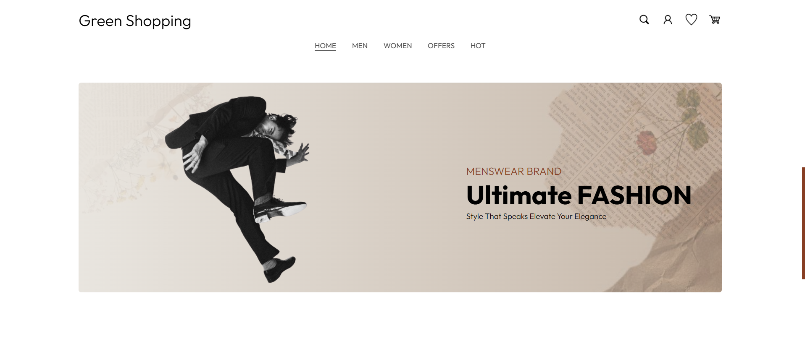
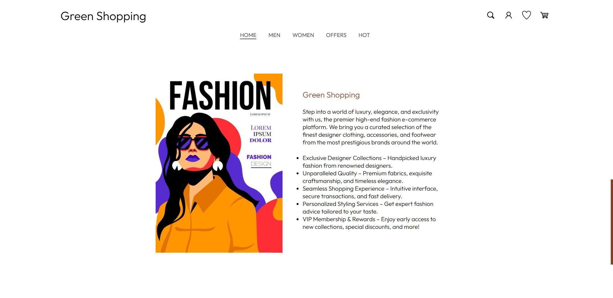
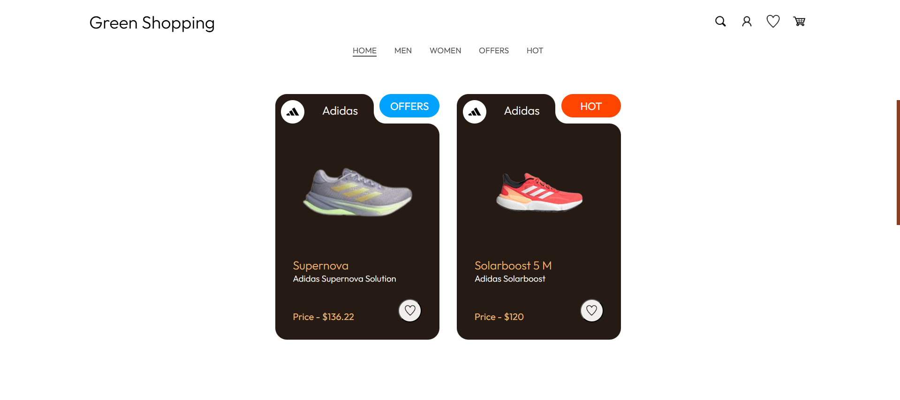
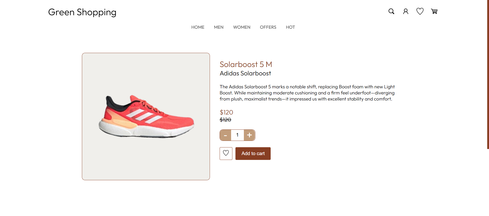
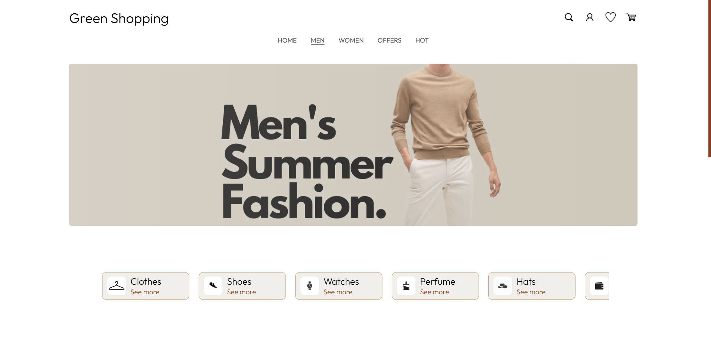
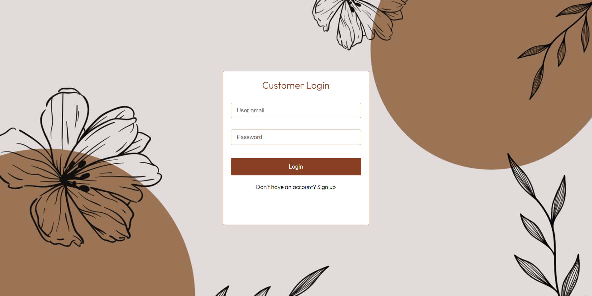
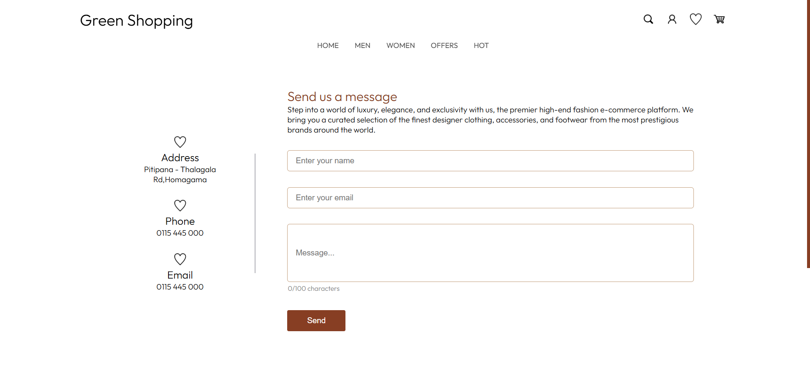

<h2 align="left">E-commerce-web-application</h2> 

<h4 align="left">LANGUAGES AND TOOLS</h4>

 

 

This is a full-stack E-commerce platform built using the MERN stack (MongoDB Atlas, Express.js, React.js, Node.js) for the PUSL3120 - Full Stack Development module coursework. The platform connects customers, sellers, and admins, enabling seamless online shopping and product management.

<h4 align="left">Key Features </h4>

<h5 align="left">Customer Features </h5>
<ul align="left">
  <li>Register/Login to the platform.</li>
  <li>Browse and search for products.</li>
  <li>Add products to the cart and wishlist.</li>
  <li>Place orders and track order status.</li>
  <li>Ask product-related questions.</li>
</ul>

<h5 align="left">Seller Features </h5>
<ul align="left">
  <li>Register/Login and manage their accounts.</li>
  <li>Add, edit, and delete products.</li>
  <li>View customer orders and update order statuses.</li>
  <li>Reply to customer inquiries about products.</li>
</ul>

<h5 align="left">Admin Features </h5>
<ul align="left">
  <li>Manage customer and seller accounts.</li>
  <li>Monitor and take action on user messages.</li>
<li>Ensure smooth platform operations.</li>
</ul>

 

This project demonstrates full-stack development skills, integrating user authentication, database management, CRUD functionalities, and real-time interactions within an interactive and scalable e-commerce platform.
 

 
 
 
 
 
 
 

